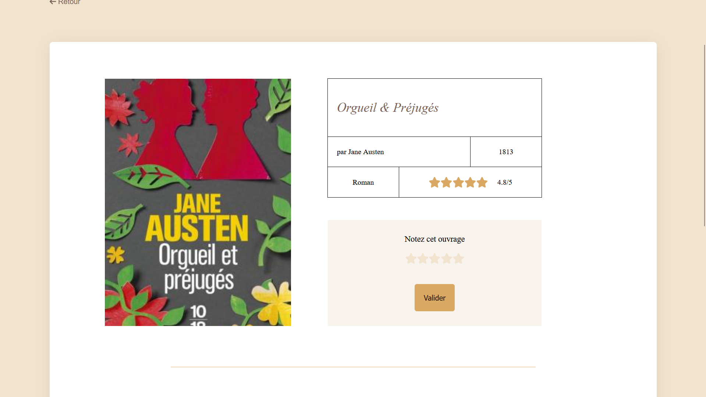

# Project 6: Développez le back-end d'un site de notation de livres

## Project Description

This project is part of the Web Developer program at OpenClassrooms. The objective is to develop the back-end for a book rating website using NodeJS.

## Features

- **Backend Development**: Built with NodeJS, this backend serves as the core for a book rating platform.
- **API Integration**: Provides endpoints for managing book data and user ratings.

## Appearance 
    

## Installation

1. Clone this repository to your local machine.
2. Navigate to the project directory.
3. Run the following command to install all dependencies:
```bash
npm install
```
4.To set up the front-end, you can find the corresponding repository [here](https://github.com/OpenClassrooms-Student-Center/P7-Dev-Web-livres).

## Usage
This project is a school assignment and is not intended for production use. It showcases my skills in back-end development and is featured on my portfolio.

## Contributing
This project is not open for contributions, as it is part of my portfolio and is based on a school assignment.

## License
All rights reserved. The content and code are owned by OpenClassrooms.

## Contact
For more information, you can reach me through my portfolio [here](https://roxane-myportefolio.netlify.app/).
